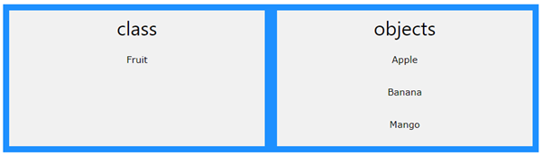

{: .highlight }
💡 _Last Update_: 29 April 2023

# C++ Apa itu OOP
OOP adalah singkatan dari Object-oriented programming. Pemrograman prosedural adalah tentang menulis prosedur atau fungsi yang melakukan operasi pada data, sedangkan pemrograman berorientasi objek adalah tentang membuat objek yang berisi data dan fungsi. Object-oriented OOP memiliki beberapa keunggulan dibandingkan pemrograman prosedural:

1. OOP lebih cepat dan lebih mudah dieksekusi
2. OOP menyediakan struktur yang jelas untuk program
3. OOP membantu menjaga kode C++ DRY "Don't Repeat Yourself", dan membuat kode lebih mudah untuk dipelihara, dimodifikasi, dan di-debug
4. OOP memungkinkan untuk membuat aplikasi penuh yang dapat digunakan kembali dengan lebih sedikit kode dan waktu pengembangan yang lebih singkat

## C++ Apa itu Class dan Object?

Kelas dan objek adalah dua aspek utama dari pemrograman berorientasi objek. Perhatikan ilustrasi berikut untuk melihat perbedaan antara kelas dan objek:

Jadi, kelas adalah templat untuk objek, dan objek adalah turunan dari kelas.
Saat objek individu dibuat, mereka mewarisi semua variabel dan fungsi dari kelas.
Anda akan belajar lebih banyak tentang kelas dan objek di bab berikutnya.