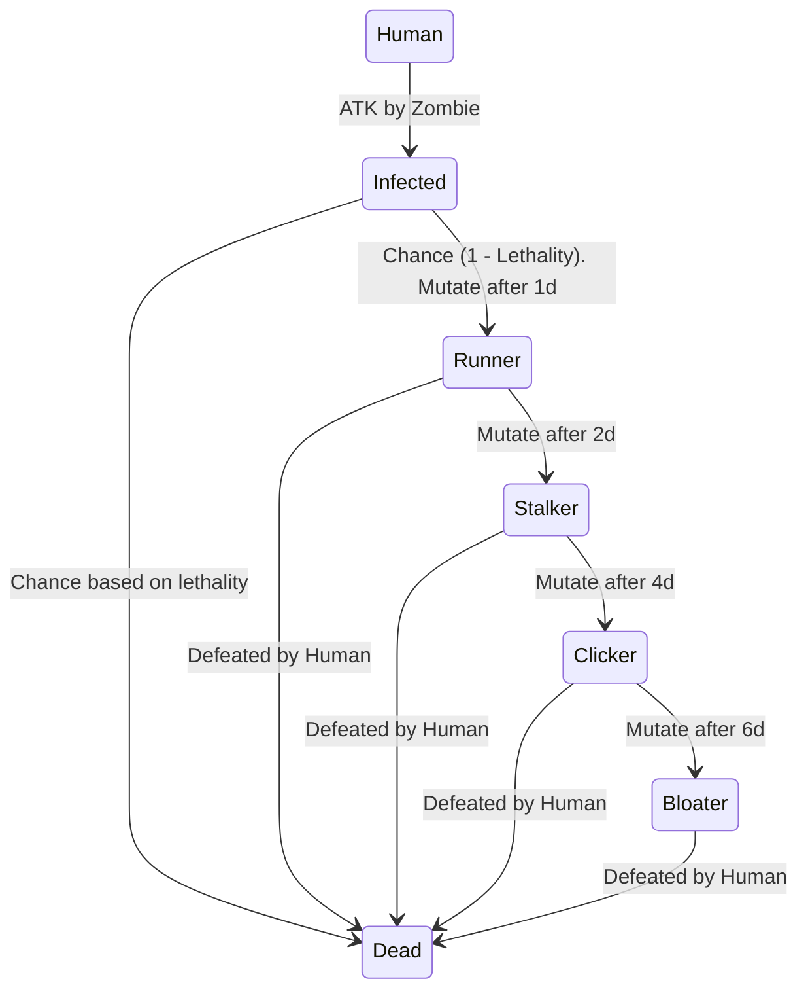

{: .highlight }
💡 _Last Update_: 28 Mei 2023

# The End of Us (Polymorphism)


Download the project template here

[Download](https://github.com/Projects-of-Asisten/2023/raw/main/p4/soal/template_polymorphism.zip){: .btn }

## **PROLOGUE**

_New York, 23 April 1967_

**DR. SCHOENHEISS:** My biggest worry is a viral pandemic, likely transmitted through air travel.

**DR. NEUMAN:** I'm not concerned about viruses or bacteria. Fungi are the real threat.

**HOST:** Fungi? How so?

**DR. NEUMAN:** There are fungi that can control the minds of insects and even alter human behavior.

**DR. SCHOENHEISS:** But humans aren't susceptible to fungal infections that control behavior.

**DR. NEUMAN:** True, but if the world gets warmer, fungi could evolve to infect humans and take control of our minds.

**HOST:** And there are no treatments or cures?

**DR. NEUMAN:** None. We lose if that happens.

## **PRESENT DAY**

### Chapter 1: The Outbreak

_Jakarta, 24 September 2003_

It started as a strange phenomenon reported in the outskirts of the city. People showed unusual behavior, attacking others without provocation. The Mayor dismissed it as urban legends, but little did they know, Dr. Neuman's ominous prediction had come true. A new strain of fungus had evolved, infecting humans and turning them into mindless, aggressive creatures.

### Chapter 2: The Problem

_Surabaya, 26 September 2003_

The spread began in your City, As a computer engineer from Institut Teknologi Sepuluh Nopember, you knew that you had to act fast to prevent the outbreak from spreading further. You started conducting research and discovered that the fungus was transmitted through physical contact, just like a virus. `Infected humans` would turn into zombies `one day after being attacked`, and there was a chance that they would `die or turn into zombies` themselves when attacked.

You decided to create a simulation of the outbreak to better understand the situation and develop a strategy to combat it. You set up a virtual world with a size of `(100, 100)` and populated it with `humans, runners, stalkers, clickers, and bloaters`. Each entity had a different defense and attack power, with the bloaters being the most powerful.

The zombies had a `lethality score` that `determined the likelihood of a human dying` if they were attacked. Runners had the lowest lethality score, while bloaters had the highest. The `radius of each zombie's` attack also `depended on their stage`, with bloaters having the largest radius.

You established the rules of the simulation. `Humans could not initiate an attack`, but `zombies could`. `Zombies` could only attack `within their radius`, and they would `target the nearest human`. If there were `multiple humans` at the `same distance`, the zombie would `attack the first one` it encountered. If the `zombie won`, it would `swap positions` with the `defeated human`. If the `human won`, it would `swap positions` with the `defeated zombie`. If `human` and `zombie` `tie` it would kill both of them.

Infected humans could not attack zombies or humans. If a `human` was `attacked`, there was a `chance` that they would `die` or turn into a `zombie`. The chance between die and turn into zombie is determined by the attacker stats. (See below)

Runners would mutate into stalkers after two days, stalkers into clickers after four days, and clickers into bloaters after six days. Infected humans would mutate into runners after one day. (See below for more detailed mutation)

In a day there are `24 cycles`, with `each cycle` representing `one attack`. The goal was for one entity to defeat the other.

With the rules established, you launched the simulation and watched as the outbreak unfolded. You recorded the number of zombies, infected humans, and humans each day and continued the simulation until there were no humans or zombies left. The simulation could be stopped if there is no changes after one cycles.

### Output Example

```
Day 1:
24 Zombies
0 Infected Humans
100 Humans
Day 2:
30 Zombies
1 Infected Humans
64 Humans
.
. This output is truncated for brevity.
.
Day 8:
78 Zombies
16 Infected Humans
0 Humans
No Human Left.
```

## **RESEARCH DATA**

### Entities Stats:

| Entity  | ATK     | DEF      | Lethality | Radius |
| :------ | :------ | :------- | :-------- | :----- |
| Human   | 200-600 | 200-400  | -         | -      |
| Runner  | 100-200 | 100-200  | 0.1       | 13     |
| Stalker | 200-300 | 200-300  | 0.2       | 12     |
| Clicker | 400-600 | 300-500  | 0.8       | 11     |
| Bloater | 500-800 | 600-1000 | 0.9       | 15     |

For example for lethality stats, If a Human got defeated by a zombie with 0.8 lethalities, it means that the human has an 80% chance to die and a 20% chance to turn into a zombie.

### Mutation Stages:



### Attack Formula:

When zombie and human attack each other, their ATK and DEF stats are used to determine the winner. The winner is determined by comparing the effective attack and defense values of the entities. The effective attack value of a entities is calculated as their ATK stat minus the opponent's DEF stat. If the effective attack value is negative, it is treated as zero. The effective defense value of a entities is calculated as their DEF stat plus the opponent's DEF stat. To determine the winner of the combat, you compare the effective attack value of one entities to the effective defense value of the other, and vice versa. The entities with the higher effective attack value wins the combat.

The formula for calculating the effective attack and defense values is:

```python
Effective Attack Value = max(ATK - DEF_opponent, 0)
Effective Defense Value = DEF + DEF_opponent
```

Where:

- **ATK** is the attacker's attack stat
- **DEF** is the defender's defense stat
- **DEF_opponent** is the opponent's defense stats

## **THE END**
